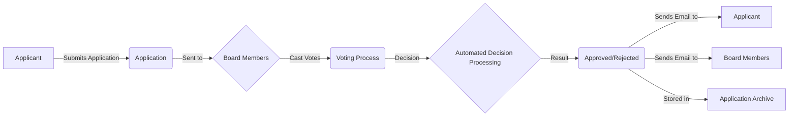

# ProjectVote

[](https://opensource.org/licenses/MIT)
[](https://github.com/andreas-vester/ProjectVote/actions/workflows/main.yml)

ProjectVote is a funding application management system designed to streamline the process of submitting, reviewing, and deciding on project funding requests for associations and organizations.

## Features

-   **Application Submission:** User-friendly form for submitting new funding requests.
-   **Token-Based Voting:** Secure, unique voting links for board members to review and cast votes.
-   **Automated Decision Processing:** Automatic status updates and notifications based on board votes.
-   **Application Archive:** A historical record of all funding applications and their outcomes.

## Application Workflow

Here's a high-level overview of how the application process works in ProjectVote:



## Localization

The current user interface (GUI) of ProjectVote is primarily in German. We are keen to make the application accessible to a wider audience by supporting multiple languages.

If you are interested in contributing to the internationalization of ProjectVote, either by providing language packs or helping to implement a robust multilingual system, please refer to our [CONTRIBUTING.md](CONTRIBUTING.md) for details on how to get involved. Your contributions would be highly valued!

## Screenshots

### Creating a new application


### Applications archive


## Getting Started

The recommended way to run ProjectVote is by using the pre-built Docker images from GitHub Container Registry.

### Prerequisites

- Docker
- Docker Compose

### Running the Application

1.  **Create a `docker-compose.yml` file** with the following content:

    ```yaml
    services:
      backend:
        image: ghcr.io/andreas-vester/projectvote-backend:latest
        ports:
          - "8008:8008"
        volumes:
          - ./data:/app/data
        env_file:
          - .env
        restart: unless-stopped

      frontend:
        image: ghcr.io/andreas-vester/projectvote-frontend:latest
        ports:
          - "5173:80"
        depends_on:
          - backend
        restart: unless-stopped
    ```

2.  **Create a `.env` file** in the same directory by copying the example below. This file stores sensitive configurations, suchs as board member emails and email server settings.

    > **Note:** You can also download the example file from the [repository](https://github.com/andreas-vester/ProjectVote/blob/main/.env.example).

3.  **Run the application** using Docker Compose:

    ```bash
    docker compose up -d
    ```

4.  **Access the application:**
    - **Frontend:** [http://localhost:5173](http://localhost:5173)
    - **Backend API:** [http://localhost:8008](http://localhost:8008)

The application should now be running. Docker Compose will pull the latest images from the GitHub Container Registry.

## For Developers & Contributing

We welcome contributions to ProjectVote! If you're interested in fixing bugs, adding new features, or improving the documentation, please see our [CONTRIBUTING.md](CONTRIBUTING.md) file for details.

## Configuration

To provide a clearer picture of the setup, here are the contents of the main configuration files.


### Environment Variables (`.env`)

```env
# -----------------------------------------------------------------------------
# Application URLs
# -----------------------------------------------------------------------------
# The public base URL of the frontend application.
# Used for generating links in emails.
FRONTEND_URL=http://your-production-domain.com

# -----------------------------------------------------------------------------
# Board Configuration
# -----------------------------------------------------------------------------
# Comma-separated list of board member email addresses
BOARD_MEMBERS=board.member1@example.com,board.member2@example.com

# -----------------------------------------------------------------------------
# Database Configuration
# -----------------------------------------------------------------------------
# Set to False in production to prevent logging every SQL query.
DB_ECHO=False

# -----------------------------------------------------------------------------
# Email Configuration (for fastapi-mail)
# -----------------------------------------------------------------------------
# Example for a real SMTP server (e.g., SendGrid, Mailgun)
MAIL_DRIVER=smtp
MAIL_SERVER=your-smtp-server.com
MAIL_PORT=587
MAIL_STARTTLS=True
MAIL_SSL_TLS=False
MAIL_USERNAME=your-smtp-username
MAIL_PASSWORD=your-smtp-password
MAIL_FROM=noreply@your-production-domain.com
MAIL_FROM_NAME="ProjectVote"
```

## Database

The application uses a SQLite database to store application data.

### Location and Persistence

The database is stored in the `data` directory at the root of the project. This is achieved using a bind mount in `docker-compose.yml`, which maps the `./data` directory on your host machine to the `/app/data` directory inside the `backend` container.

This ensures the database file (`applications.db`) is directly accessible on your filesystem and persists across container restarts.

### Accessing the Database

Since the database file is on your host machine at `data/applications.db`, you can open it using any standard SQLite database tool. There is no need to connect to the running container.

## License

This project is licensed under the MIT License - see the [LICENSE](LICENSE) file for details.
